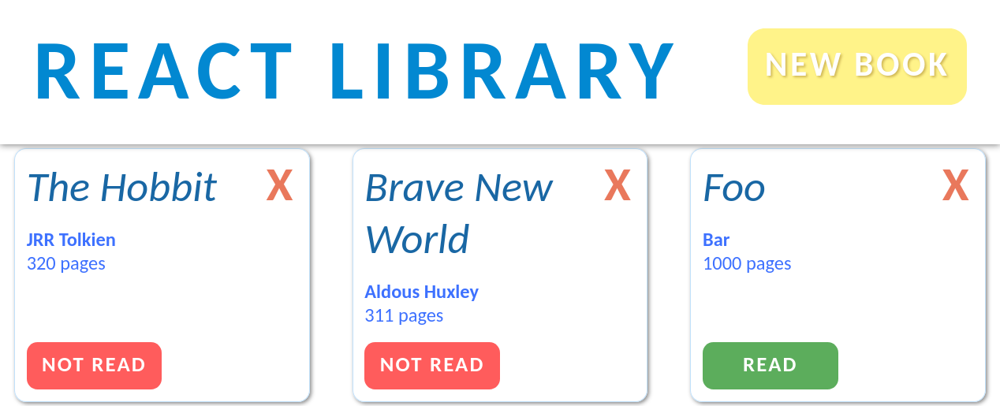

# [React-Library](https://clavierbulb-green.github.io/React-Library/)

---
A simple library app, written to practice building with React.
A remake of a previous library app, written as a solution to [Project: Library]((https://www.theodinproject.com/courses/javascript/lessons/library), part of the [Odin Project](https://www.theodinproject.com/home).

---
## TODO
- [x] New Book button should bring up New Book Form; form hidden otherwise
- [x] Prettify elements/design
- [x] Display and allow updating of read status on Book Cards
- [ ] Allow updating Book fields on Book cards

---
## References
+ [Persisting Data to Local Storage in a React Single-Page Application](https://medium.com/@siobhanpmahoney/local-storage-in-a-react-single-page-application-34ba30fc977d)
+ [uuid - npm](https://www.npmjs.com/package/uuid)
+ [javascript - ReactJS how to delete item from list - Stack Overflow](https://stackoverflow.com/questions/43230622/reactjs-how-to-delete-item-from-list)
+ [javascript - Call multiple functions onClick ReactJS - Stack Overflow](https://stackoverflow.com/questions/26069238/call-multiple-functions-onclick-reactjs)
+ [Client-side form validation - Learn web development | MDN](https://developer.mozilla.org/en-US/docs/Learn/Forms/Form_validation)
+ [css - How to justify a single flexbox item (override justify-content) - Stack Overflow](https://stackoverflow.com/questions/23621650/how-to-justify-a-single-flexbox-item-override-justify-content)
+ [javascript - React Js conditionally applying class attributes - Stack Overflow](https://stackoverflow.com/questions/30533171/react-js-conditionally-applying-class-attributes)
+ [Array.prototype.map() - JavaScript | MDN](https://developer.mozilla.org/en-US/docs/Web/JavaScript/Reference/Global_Objects/Array/map)
